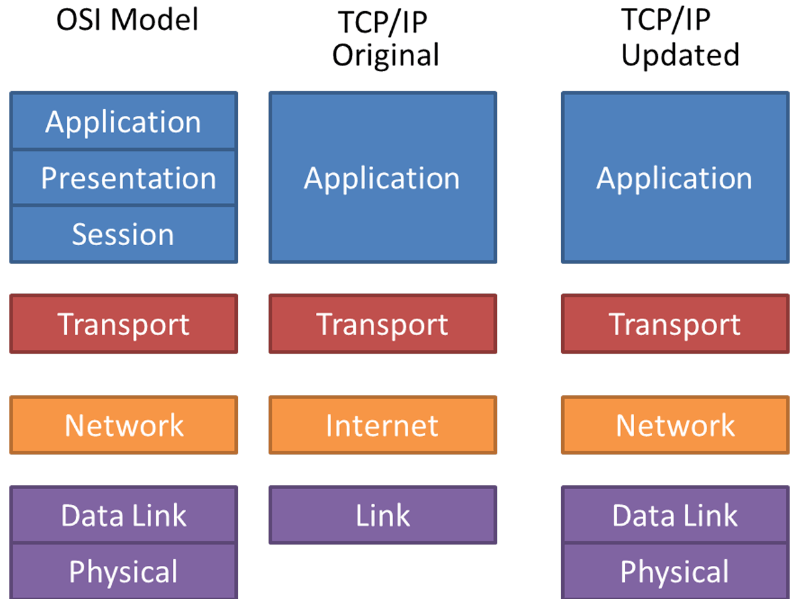

# [네트워크] OSI 7계층과 TCP/IP 4계층

## 💡 tl;dr

---

- OSI 7계층이란 무엇인가
- 계층별 특징 파악

 

 

 

#  OSI란? 

---

- Open System Interconnection Reference Model의 약자
- 국제표준화기구(ISO)에서 프로토콜과 통신을 계층으로 나누어 설명하기 위해 개발한 모델
  - `TCP/IP` 모델과의 시장 점유 싸움에서 밀려 현대 인터넷에 사용되지 않는다.
- `Layered Architecture`를 따르는 거대한 네트워크 시스템 구조를 설명하는 것
- 이 모델은 프로토콜을 기능별로 나눈 것이다.
- 각 계층은 하위 계층의 기능만을 이용 가능하고 상위 계층에게 기능을 제공한다.
- 일반적으로 하위 계층들은 하드웨어로, 상위 계층들은 소프트웨어로 구현되어 있다.

 

 

# 1계층 / 물리 계층(Physical)

---

- 물리 계층은 네트워크의 **하드웨어 전송 기술**로 구성 
- 고수준의 논리 데이터 구조가 기초로 요구되는 필수 계층 
- 다양한 특징의 하드웨어 기술이 접목되어 있어 OSI 아키텍처에서 가장 복잡한 계층으로 간주

 

## 신호로 변환하여 전송하는 계층
- 모든 파일과 프로그램은 `0`과 `1`의 나열
- 통신이란 간단히 컴퓨터 끼리 `0`과 `1`을 주고 받는 것
- 컴퓨터는 `0`과 `1`의 나열을 아날로그 신호로 바꿔 전선으로 전송 (`encoding`)
- 아날로그 신호가 들어오면 이를 `0`과 `1`의 나열로 해석 (`decoding`)
- 물리적으로 연결된 두 컴퓨터가 `0`과 `1`의 나열을 주고받을 수 있게 해주는 것은 모듈(`module`)
- 이러한 모듈(함수와 같은 역할을 하는 회로)은 하드웨어적(`PHY` 칩)으로 구현

 

## 시스템의 전기적, 물리적 표현
- 케이블 종류,(802.11 무선 시스템에서와 같은) 무선 주파수 링크는 물론 핀 배치, 전압, 물리 요건 등이 포함
- 전기적, 기계적 특성을 이용하여, 통신 케이블로 전기적 신호(에너지)를 전송 / 전송 단위 : bit
- 단지 데이터 전달 역할만을 하고, 알고리즘이나 오류 제어기능은 존재하지 않는다

 

## 사용 장비 
- Hub, Repeater, Cable

 

## 프로토콜
- Ethernet.RS-232C

 

 

# 2계층 / 데이터 링크 계층(Data Link)

---

- 데이터 링크 계층은 포인트 투 포인트(ex: 컴퓨터 to 컴퓨터)간 신뢰성있는 전송을 보장하기 위한 계층
- **동일한** 네트워크 내에서의 전송을 담당 (이더넷)
- 에러검출/재전송/흐름제어
- 프레임에 주소부여(`MAC` - 물리적주소)

 

## 전송 신뢰성 보장

- 오류없이 한 장치에서 다른 장치로 프레임(`Frame`, 비트의 모음)을 전달하는 역할
- 물리 계층에서 발생할 수 있는 오류를 찾아 내고, 이를 수정하는데 필요한 기능 및 절차적 수단을 제공
- 이를 위해 CRC(Cyclic Redundancy Check) 기반의 오류 제어와 흐름 제어가 필요
- 오류가 있다면 해당 데이터를 폐기한다

 

## 여러 대의 컴퓨터 간의 통신

- 1계층에 속하는 기술 만으로는 여러 대의 컴퓨터가 통신하도록 만들 수 없다.
- 여러 컴퓨터에서 동시에 데이터를 전송 받았을 때 그 출처를 알기 힘들다.
- 그래서 데이터에 특정 비트열을 추가(`encode`)해서 보내는데, 이를 `framing`(프레이밍)이라 하고, `encode` 된 데이터를 `frame`이라 한다.
- 여러 데이터를 받고 그 데이터 안에 포함된 특정한 비트열 `MAC` 주소를 인식하여 어떤 컴퓨터에서 전송된 데이터인지 구별할 수 있다.

 

## 하드웨어적 구현

- Data-link Layer 기술은 랜카드(네트워크 카드)에 구현되어 있다.
- 즉, 1계층과 동일하게 **하드웨어적** 구현으로 되어있다.
- 네트워크 카드가 만들어질 때부터 맥 주소(`MAC address`)가 정해진다.

 

## 사용 장비
- Bridge, Switch

 

## 프로토콜
- MAC, PPP, HDLC, Frame-Relay, FDDI, ATM, etc...

 

 

# 3계층 / 네트워크 계층(Network)

---

- 서로 **다른** 두 네트워크 간의 데이터 전송을 담당
- 주소부여(IP)
- 경로설정(Route)
- 운영체제 커널에 **소프트웨어적**으로 구현

 

## 논리적 주소 부여 (IP)

- 각 컴퓨터들이 갖는 고유한 논리적 주소(`IP`) 부여
- 네트워크 관리자가 직접 주소를 할당하는 구조
- 주소는 계층적(hierarchical) 구조를 갖는다.
- 전송 계층 사이에 네트워크 서비스 데이터 유닛(`NSDU`)을 교환하는 기능을 제공

 

## 네트워크 경로 설정

- 데이터(패킷,Packet)를 목적지까지 가장 안전하고 빠르게 전달하는 것 - **라우팅**
- 연결되어 있는 수 많은 라우터들 속에서 `IP` 주소를 이용해서 길을 찾고(`routing`) 목적지 까지의 경로상 바로 다음 라우터에게 데이터를 넘겨 주는 것(`forwarding`)을 도착할때까지 반복.
- 이러한 라우팅을 통해 **인터넷**이 가능하고, 전 세계의 컴퓨터와 통신이 가능해짐.

 

## 사용 장비
- Router

 

## 프로토콜
- IP, ICMP, IGMP

 

 

# 4계층 / 전송 계층(Transport)

---

- `Port` 번호를 사용하여 최종 도착지인 **프로세스**까지 데이터가 도달하게 하는 모듈.
- 서비스를 구분하고 데이터의 전송 방식을 담당하는 계층
- 보낼 데이터(단위:`Segment`)의 용량과 **속도**, 목적지 등을 처리
- 종단간(`ent-to-end`) 통신을 다루는 최하위 계층으로, 종단 간에 신뢰성 있고 효율적인 데이터 전송이 가능하게 하여 상위 계층들이 데이터 전달의 유효성이나 효율성에 대한 고민에서 자유롭게 해준다.
- 종단 간의 에러 복구와 흐름 제어 담당 (`TCP`/`UDP`)
- 운영체제 커널에 **소프트웨어적**으로 구현

 

## 연결 지향적 프로토콜

- 일부 프로토콜은 상태(`stateful`) 저장 및 연결 지향적(`connection-oriented`)인데, 이는 전송 계층이 패킷들의 전송이 유효한지 확인하고 전송 실패한 패킷들을 다시 전송한다는 것을 뜻한다.
- 대표적으로 `TCP`는 **핸드 셰이크 프로세스**를 사용하여 발신자와 수신자 간의 연결을 설정한다.

 

## 세그멘테이션

 

- 상위 계층 데이터를 세그먼트 단위로 나누는 것
- 전체 데이터를 분할하여 전체 데이터가 100% 전송되기 전까지 기다려야할 대기시간을 줄여준다.
  - 유튜브 영상 버퍼링이 짧은 이유
- 연결이 중간에 끊겼을때 발생하는 손실율을 줄일 수 있다.

 

## 사용 장비
- Gateway

 

## 프로토콜
- TCP, UDP, ARP

 

 

# 5계층 / 세션 계층(Session)

---

- 응용 프로세스 간의 통신을 관리하기 위한 방법을 제공하는 계층.
- **세션**을 열고 닫는(상호작용 및 동기화) 메커니즘 제공
- 운영체제에 의해 통신을 하기 위한 세션을 확립/유지/중단/복구
- 현대의 `TCP/IP update` 모델에서는 응용 프로그램 계층으로 통합됨

 

## 세션(Session)

1. 두 대의 기기, 컴퓨터 또는 서버 간에 **대화**(`Message`)를 위한 논리적 연결
  - 세션의 설정 및 조율, 프로세스 연결 해제 및 종료 등의 기능 필요
2. 프로세스들 사이에 메시지 교환을 통해 서로를 인식한 이후부터 통신을 마칠 때까지의 시간

 

## 사용 장비
- NetBIOS (세션 내 연결관리 및 에러감지, 복구 수행)

 

## 프로토콜
- SSH, TLS

 

 

# 6계층 / 표현 계층(Presentation)

---

- 데이터(`Message`)의 **변환** 작업을 하는 계층
- 코드 간의 **번역**을 담당하여 응용 계층의 부담을 덜어줌
- 현대의 `TCP/IP update` 모델에서는 응용 프로그램 계층으로 통합됨

 

## 데이터 변환

 

 

- 데이터 표현의 차이를 변환(번역)해줌
    - 데이터 표현 차이 : ASCII, JPEG, MPEG 등의 번역 
- 전송하는 데이터의 인코딩, 디코딩, 암호화, 코드 변환 등을 수행

 

## 프로토콜
- ASCII, MPEG, JPEG, MIDI, EBCDIC

 

 

# 7계층 / 응용 계층(Application)

---

- OSI 7계층 모델 최상위 계층으로, 사용자가 네트워크 자원에 접근하는 방법 제공
- 최종적으로 사용자가 볼 수 있는 유일한 계층이며 직접적으로 사용자와 **상호작용**한다.
- 모든 네트워크 활동의 기반이 되는 인터페이스 제공
  - 네트워크 소프트웨어 UI
  - 사용자의 입출력(I/O)

 

## TCP/IP 소켓 프로그래밍

- 운영체제의 Transport Layer에서 제공하는 API를 활용해서 통신 가능한 프로그램을 만드는 것
- 네트워크 프로그래밍이라고도 불림
- 소켓 프로그래밍 만으로도 클라이언트, 서버 프로그램을 따로 만들어서 동작 시킬 수 있다.
  - 누구나 자신만의 application layer 인코더 디코더를 만들 수 있음
  - 암호화, 압축, 인코딩, 디코딩, 통신회선 구축

 

## 프로토콜
- DHCP, DNS, FTP, HTTP, SMTP, Telnet

 

 

# 참고

---

[OSI 모형 - 위키백과](https://ko.wikipedia.org/wiki/OSI_%EB%AA%A8%ED%98%95)

[[10분 테코톡] 히히의 OSI 7 Layer - 우아한Tech Youtube](https://www.youtube.com/watch?v=1pfTxp25MA8&ab_channel=%EC%9A%B0%EC%95%84%ED%95%9CTech)

[[10분 테코톡] 파즈의 OSI 7 Layer - 우아한Tech Youtube](https://youtu.be/Fl_PSiIwtEo)

[[초보자 전용 마을] OSI 7계층, TCP/IP 4계층](https://ryusae.tistory.com/4)

[[人CoDOM] OSI](http://www.incodom.kr/OSI)

[OSI 7계층, 각 계층이 역할 및 대표 프로토콜들](https://sean.tistory.com/22)